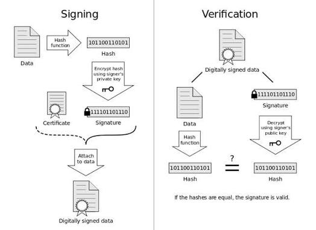

# Fundmental about securing certications

## Part 1 - Cryptography Fundamentals
Form of texts:
1. Plain Text → Normal readable data.
2. Encryption → Two way converting with special Enc/Dec methods.
3. Hash Function  → A hash is NOT encryption. One-way

## Part 2 - Symmetric/Asymmetric Encryption

**Symmetric:** One secret key encrypts and decrypts.

Popular algorithms:
- AES
- ChaCha20

```bash
echo "My Secret Data" > secret.txt

# Encrypt
openssl enc -aes-256-cbc -salt -pbkdf2 -in secret.txt -out secret.enc -k myPassword123

# Decrypt
openssl enc -d -aes-256-cbc -pbkdf2 -in secret.enc -out decrypted.txt -k myPassword123
```

**Asymmetric:** Uses two keys. Public Key, Private Key
Only the private key can decrypt data encrypted with the matching public key.
Public Key → Encrypt → Ciphertext → Private Key → Decrypt

Algorithms:

RSA
ECC (Elliptic Curve)
Ed25519 (commonly used for signatures and SSH)

```bash
# Generate a Private Key (RSA 2048-bit)
openssl genrsa -out private_key.pem 2048

# Extract the Public Key from it:
openssl rsa -in private_key.pem -pubout -out public_key.pem
```

## Part 3 - Digital Signature

Use for Authentication and Integrity of A Data.



note: only Matched publickey can decrypt the encrypted file with private key

## Part 5 - Why TLS Uses Both asymmetric and symmetric
Because asymmetric encryption is slow. Asymmetric (RSA/ECDSA) Used ONLY at the start (the Handshake) then rest of session send Symmetric.

## Part 6 - PKI (Public Key Infrastructure)

The Theory: If I give you my Public Key, how do you know it's actually mine and not a hacker's?
PKI is the system of trust. It relies on a Trusted Third Party called a Certificate Authority (CA) (e.g., DigiCert, Let's Encrypt).
The CA verifies my identity, then digitally signs my Public Key using their Private Key.

## Part 7 - Certificates (X.509)
A certificate is simply a Public Key that has been wrapped in metadata (Who owns it? What domain? When does it expire?) and digitally signed by a CA.

```bash
# OpenSSL "Self-Signed" Certificate(for test)
openssl req -new -x509 -key private_key.pem -out certificate.crt -days 365 -subj "/CN=mywebsite.local"

# Inspect the certificate 
openssl x509 -in certificate.crt -text -noout
```

## Part 8: TLS Handshake (The "Secret Handshake")

The Theory (Step-by-Step):

**Client Hello:** You (Browser) send a "Hello" to Google, listing the Ciphers (AES vs ChaCha) you support.

**Server Hello:** Google sends back its Certificate (which contains its Public Key, signed by a CA).

**Verification:** Your browser checks Google's certificate against its internal "Trust Store" (list of trusted CA Public Keys). If the signature checks out, your browser trusts Google.

**Key Exchange:** Your browser generates a random "Pre-Master Secret," encrypts it with Google's Public Key (from the certificate), and sends it to Google.

**Session Keys:** Google decrypts this with its Private Key. Now, both sides have the same secret. They both run a math formula to generate the actual "Session Keys" (Symmetric keys).

**Finished:** They switch to Symmetric Encryption and send a test encrypted message. If it works, the handshake is complete, and secure browsing begins.

## Important File Types
| File            | Purpose                                                                             |
| --------------- | ----------------------------------------------------------------------------------- |
| `.key`          | Private key                                                                         |
| `.pub`          | Public key (common for SSH; X.509 public keys are usually embedded in certificates) |
| `.csr`          | Certificate Signing Request                                                         |
| `.crt` / `.cer` | Certificate                                                                         |
| `.pem`          | Base64 container that can hold keys, certificates, or chains                        |
| `.der`          | Binary-encoded certificate or key                                                   |
| `.p12` / `.pfx` | PKCS#12 bundle containing certificate(s) and private key                            |
