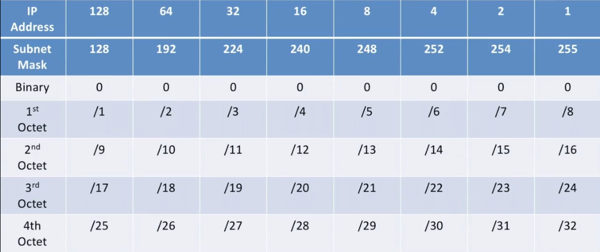

For Example :
- 172.16.8.0/20
    - Subnet Mask       → 255.255.240.0
    - First Usable IP	→ 172.16.8.1
    - Last Usable IP	→ 172.16.23.254

 - 10.1.200.0/22   
    - Subnet Mask       → 255.255.252.0
    - First Usable IP	→ 10.1.200.1
    - Last Usable IP	→ 10.1.203.254

- 172.16.8.0/24
    - Subnet Mask       → 255.255.255.0
    - First Usable IP	→ 172.16.8.1
    - Last Usable IP	→ 172.16.8.254  

- 172.16.8.0/25
    - Subnet Mask       → 255.255.255.128
    - First Usable IP	→ 172.16.8.1
    - Last Usable IP	→ 172.16.8.126